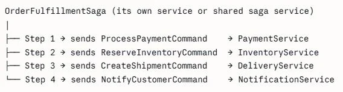

1-Catalog

### Use Mongo Express to manage your MongoDB database.
http://localhost:8081

This basic security is part of the image, probably.
user: admin
password: pass

### SQL Server
Database=OrderDb
User Id=sa
Password=Password@1

### pgAdmin
user: admin@eCommerce.net
pass: Password@1

### rabbitMQ: http://localhost:15672/
user: guest
pass: guest

### Portainer
user: admin
pass: Password@123

### Entity Framework Core

- Add migration: add-migration <MigrationName> -StartupProject Order.API -Project Order.Infrastructure -Context OrderContext 
- Update database: update-database -StartupProject Order.API -Project Order.Infrastructure -Context OrderContext
- Revert the very first migration: update-database 0 -StartupProject Order.API -Project Order.Infrastructure -Context OrderContext
- Remove migration: remove-migration -StartupProject Order.API -Project Order.Infrastructure -Context OrderContext

## Create Migration in "Order"

add-migration Initial-Migration -StartupProject Order.API -Project Order.Infrastructure

## Apply db migration in "Order"

Run the application to apply migrations to the database. The logic is in the Program.cs file

### Connecting to SQL Server running in a docker container from local machine using SQL Server Management Studio (SSMS)

- Server: localhost,1433
- User: sa
- Password: Password@1

https://github.com/rahulsahay19/dot-net-core-microservices-8

### Testing basket flow

http://localhost:8001/api/v1/Basket/CreateBasket
{
  "userName": "bruno.candia",
  "items": [
    {
      "productId": "998d2149e773f2a3990b47fa",
      "productName": "Adidas FIFA World Cup Top Glider Ball",
      "productImage": "adidas_football-3.png",
      "price": 2499,
      "quantity": 2
    }
  ]
}

http://localhost:8001/api/v1/Basket/CheckoutBasket
{
  "userName": "bruno.candia",
  "totalPrice": 4998,
  "firstName": "bruno",
  "lastName": "candia",
  "emailAddress": "bruno@ecommerce.net",
  "addressLine": "test address",
  "country": "USA",
  "state": "IN",
  "zipCode": "4600",
  "cardName": "VISA",
  "cardNumber": "4242-4242-4242-4242",
  "expiration": "12/30",
  "cvv": "123",
  "paymentMethod": 1
}

### Verify the Order

http://localhost:8003/api/v1/Order/GetOrderByUserName/bruno.candia

## Create Migration in "Identity"

Run Docker Compose without debugging

Run the following command in the Package Manager Console

- Add migration: add-migration Initial-Migration -StartupProject Identity.API

## Apply db migration in "Identity"

Run Docker Compose without debugging

Run the following command in the Package Manager Console

- Update database: update-database -StartupProject Identity.API

### Connecting to SQL Server running in a docker container from local machine using SQL Server Management Studio (SSMS)

- Server: localhost,1434
- User: sa
- Password: Password@1

## Angular 20

### Run Frontend

"ng serve" or "npm start"

### Files naming for components and services

In the file angular.json add the type entry into schematics. 

Example when using the command from the Client folder
"ng generate component layout/header --dry-run" the output will be "src/app/layout/header/header.component.ts" instead of "src/app/layout/header/header.ts"

Example when using the command from the Client folder
"ng generate component features/shop" the output will be "src/app/features/shop/shop.component.ts" instead of "src/app/features/shop.ts"

Example when using the command from the Client folder
"ng generate component features/shop/product-item" the output will be "src/app/features/shop/product-item/product-item.component.ts" instead of "src/app/features/shop/product-item.ts"

Example when using the command from the Client folder
"ng generate service core/services/shop" the output will be "src/app/core/services/shop.service.ts" instead of "src/app/core/services/shop.ts"

"schematics": {
  "@schematics/angular:component": {
    "style": "scss",
    "type": "component"
  },
  "@schematics/angular:service": {
    "type": "service"
  }
},

## Run Backend using Visual Studio wtih Docker Compose support

Below is a focused guide for using existing Docker Compose support in Visual Studio 2022 with your solution.

1. Verify Compose Project in Solution  
Your service projects already reference docker-compose.dcproj via DockerComposeProjectPath. In Solution Explorer:  
- If the docker-compose node is missing: Add > Existing Project... and select docker-compose.dcproj.  
- Set it (or any API project) as startup. For multi-service debugging choose Solution Properties > Startup Project > Multiple startup projects and set Action: Start for the APIs (or just select the docker-compose project to let VS orchestrate all).

2. What Visual Studio Generates  
When you start debugging with the docker-compose project:  
- VS merges: docker-compose.yml + docker-compose.override.yml + a generated file (e.g., docker-compose.vs.debug.g.yml).  
- It injects extra labels, mounts your source (for fast inner-loop), and sets ASPNETCORE_ENVIRONMENT=Development.  
You keep authoring only the two existing files; do not edit the generated one.

3. Profiles / Run Modes  
In the debug dropdown you will see:  
- Individual project (e.g., Catalog.API) � runs a single container (Dockerfile).  
- docker-compose � runs everything defined. Pick docker-compose to spin up all infra plus APIs (Mongo, Redis, Postgres, SQL Server, RabbitMQ, Elasticsearch, etc.).

4. Debugging  
- Press F5 on docker-compose project > containers build (if needed) > start.  
- VS auto-attaches debugger to each .NET container with ASPNETCORE_HTTP_PORTS=8080.  
- Breakpoints work normally.  
- For hot reload ensure Tools > Options > Debugging > Hot Reload > Enable Hot Reload is on.

5. Container Logs & Management  
Use:  
- View > Other Windows > Containers (or View > Cloud Explorer depending on tooling).  
- Right-click a container > View Logs. Alternatively run:  
  docker compose logs -f catalog.api

6. Environment Variables & Configuration  
Currently in docker-compose.override.yml you already define per service variables (ConnectionStrings__MongoDb, etc.). To tweak only for VS debugging:  
- Add them under the corresponding service in docker-compose.override.yml.  
- Re-run (VS will rebuild the effective compose graph).  
Secrets options: .env file; or user-secrets when running without containers. For production-like settings create docker-compose.prod.yml and add a launch profile (-f docker-compose.yml -f docker-compose.prod.yml up).

7. Fast Edit vs Rebuild  
- Simple C# changes: Hot Reload applies.  
- Dependency changes (csproj package add): image rebuild.  
- Dockerfile changes: stop (Shift+F5) then F5.

8. Adding a New Service  
- Add new Web API project.  
- Right-click project > Add > Container Orchestration Support > Docker Compose.  
- VS updates docker-compose.dcproj and override file.

10. Switching to Command Line Easily
From solution root:

docker compose up -d  
docker compose down  

Same files used by VS.

11. Inspect Effective Compose  
Generated merged file under docker-compose/obj (read-only for troubleshooting).

12. Attaching to Already Running Containers  
Debug > Attach to Process� > Connection Type: Docker > select container (dotnet process).

13. Rebuilding Individual Service  
Containers tool window: right-click service > Rebuild / Restart.

14. Cleaning Volumes (Reset Data)  
docker compose down -v  
(Removes Mongo, Postgres, SQL, Elasticsearch data.)

15. Testing Flow (Inside VS)  
- http://localhost:8000 (Catalog Swagger)  
- POST Basket checkout: http://localhost:8001/api/v1/Basket/CheckoutBasket  
- http://localhost:8003/swagger (Order)  
- Tools: Mongo Express 8081, RabbitMQ 15672, pgAdmin 5050.

16. Optional: Separate Dev Overrides  
- Create docker-compose.vs.override.yml.  
- Add in docker-compose project properties. Keep workstation-only settings out of shared override.

17. Performance Tips  
- Pin image versions (avoid latest).  
- Multi-stage Dockerfiles.  
- Leverage build cache ordering.

18. CI Compatibility  
CI can run:  
docker compose -f docker-compose.yml -f docker-compose.override.yml up -d --build  
.dcoproj only needed for Visual Studio.

## SAGA Explanation

The approach implemented here is Choreography-based Saga. There is no central orchestrator and each service listens to an event and independently fires the next one. That's the hallmark of Choreography.
To implement Orchestration Saga instead, MassTransit gives you a first-class MassTransitStateMachine. Here's the skeleton:

```csharp
public class OrderStateMachine : MassTransitStateMachine<OrderState>
{
    public State PaymentPending { get; private set; }

    public State Completed { get; private set; }

    public State Failed { get; private set; }

    public Event<OrderCreatedEvent> OrderCreated { get; private set; }

    public Event<PaymentCompletedEvent> PaymentCompleted { get; private set; }

    public Event<PaymentFailedEvent> PaymentFailed { get; private set; }

    public OrderStateMachine()
    {
        InstanceState(x => x.CurrentState);

        Event(() => OrderCreated, x => x.CorrelateById(m => m.Message.Id));

        Event(() => PaymentCompleted, x => x.CorrelateById(m => m.Message.OrderId));

        Event(() => PaymentFailed, x => x.CorrelateById(m => m.Message.OrderId));

        Initially(
            When(OrderCreated)
                .Then(ctx => ctx.Saga.OrderId = ctx.Message.Id)
                .Publish(ctx => new ProcessPaymentCommand { OrderId = ctx.Saga.OrderId })
                .TransitionTo(PaymentPending)
        );

        During(PaymentPending,
            When(PaymentCompleted)
                .TransitionTo(Completed)
                .Finalize(),
            When(PaymentFailed)
                .TransitionTo(Failed)
                .Finalize()
        );
    }
}
```

**Even we decide to use Orchestrator there still won't be any one single centralized point/service which might orchestrate and switch all the states of each and every microservice (like mediator pattern) but the orchestration (state switching) responsibility belongs to the scope of given domain service?
Here in the example  we consider "OrderState" orchestration which as I assume will be a part of Order microservice, but for example if we had kind of state of different domain (not related directly to the scope of order), like for example status of "Parcel Delivery to the Customer".
So what I mean, the code of such "Parcel Delivery" event orchestration would a part of its Domain service ("ParcelDeliveryService"), and again there won't be any central point dedicated for orchestrating OrderState, PaymentState, DeliveryState and all the rest of events in our application but all of them would be scattered across their domain services?**

In MassTransit Saga Orchestration, each StateMachine owns the state of one business process, not one microservice. So you are right that OrderStateMachine lives in the Order service. And ParcelDeliveryStateMachine would live in the Delivery service. There is no single God-orchestrator managing everything.
But here is the nuance — a Saga does not have to map 1-to-1 with a microservice.

In enterprise systems, you often have what is called a Process Manager — a dedicated Saga that spans multiple domains. For example:



This OrderFulfillmentSaga owns the end-to-end business process state — not the internal state of any individual service. It is a coordinator, not a controller.

So to resumee, you can have:

In small to medium systems — yes, each domain owns its own Saga. OrderStateMachine in Order service, DeliveryStateMachine in Delivery service. Scattered by design. That is fine.
In enterprise systems — you introduce a dedicated Process Manager Saga that orchestrates the cross-domain flow. But crucially — it only manages transition states (PaymentPending, ShipmentCreated etc.). It does not own business logic. Business logic stays inside each domain service.

The real-world rule of thumb: if a business process touches more than 3 services and has compensation steps — extract it into a dedicated Process Manager. If it stays within one domain boundary — keep the Saga inside that service.

There is no single God-orchestrator in well-designed systems. Each Saga owns one process. The difference is knowing when to extract a cross-domain Process Manager and when to keep it local.

**Such "Process Manager" component would appear as a separate service? Kind of non-domain microservice, but developed and deployed separately? Or it is still a pattern hidden and spread across domain services?**

Both are valid — and the choice depends on complexity.

Option 1 — Embedded in the owning domain (simpler systems)
If the process is clearly owned by one domain, keep the StateMachine inside that service. OrderFulfillmentSaga lives in the Order service because Order initiates and owns the outcome.
Deployment is simple. One less service to manage.

Option 2 — Dedicated Saga service (enterprise systems)
When the process spans many domains and no single domain clearly owns it, you extract it into a standalone service. In practice this is often called a Choreography Orchestrator or Saga Coordinator service.

This service has:
Its own database for saga state persistence
No business logic — only state transitions and command dispatching
Its own CI/CD pipeline
Scales independently from domain services
